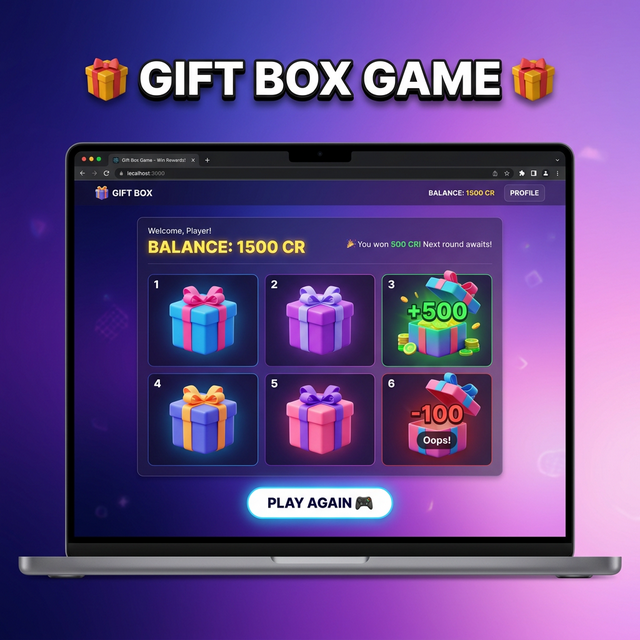

# Gift Box Game 🎁

A React-based interactive application built with Vite and Tailwind CSS.



## 🚀 Technologies Used
- **React 18**
- **Vite** (for fast development and building)
- **Tailwind CSS** (for styling)

## 📦 Getting Started

### Prerequisites
Make sure you have [Node.js](https://nodejs.org/) installed on your machine.

### Installation

1. Clone this repository or download the source code.
2. Navigate to the project directory:
   ```bash
   cd "react pr-1"
   ```
3. Install the dependencies:
   ```bash
   npm install
   ```

## 🛠️ Available Scripts

In the project directory, you can run:

### `npm run dev`
Starts the development server. Open [http://localhost:5173](http://localhost:5173) to view it in your browser.
The page will reload when you make changes.

### `npm run build`
Builds the app for production to the `dist` folder.
It correctly bundles React in production mode and optimizes the build for the best performance.

### `npm run preview`
Locally preview the production build.

## 📂 Project Structure
- `src/`: Contains the React components, styles, and core logic for the game.
- `public/`: Static assets.
- `package.json`: Project dependencies and scripts.
- `vite.config.js`: Configuration for Vite.
- `tailwind.config.js`: Configuration for Tailwind CSS.
